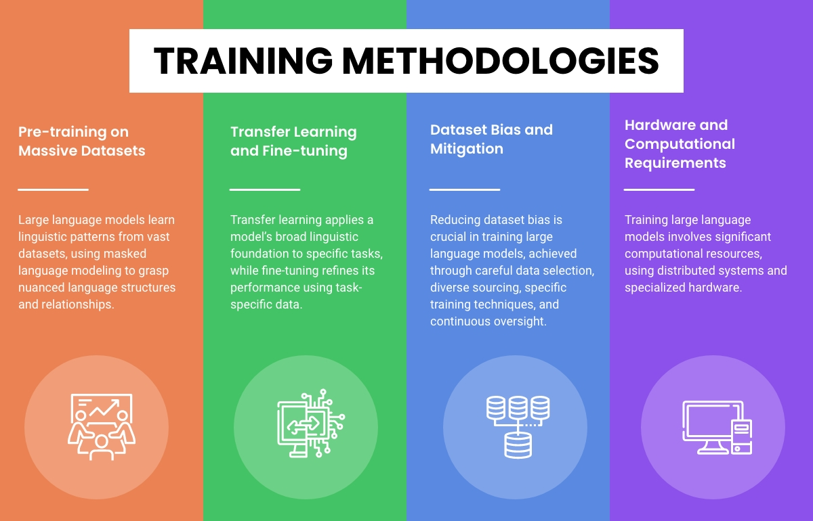

From collecting and organizing data to adjusting the model, we'll cover the key steps in training LLMs. This involves understanding the intricacies of data preprocessing, selecting the right model architecture, and employing techniques for efficient training.

Whether you're a new researcher, an experienced developer, or someone keen on diving into the world of LLMs, this guide will not only offer a clear path to training a language model but also insights into best practices and common pitfalls to avoid.

### Pre-training on Massive Datasets:
-------

An essential stage in training large language models is pre-training, during which the model is taught using vast datasets filled with substantial amounts of unlabeled textual data. These datasets often come from a wide array of sources, including books, articles, websites, and more. Through pre-training, the model encounters various linguistic patterns and situations, bolstering its capacity to comprehend and produce text that resembles human language.

The primary goal of this pre-training is a process called masked language modeling. Here, the model learns to deduce missing words or tokens from the context provided. This method of teaching the model to complete sentences ensures it grasps the nuanced relationships and structures within the language. The sheer volume of data used for pre-training offers notable benefits. First, the model learns a diverse set of language behaviors, from the everyday to the more unusual. Additionally, the vastness of the data equips the model with a wide-ranging knowledge, enabling it to operate effectively across various tasks and fields.

### Transfer Learning and Fine-tuning:

Transfer learning and fine-tuning play critical roles in the training process of large language models. Once the pre-training phase is complete, the model undergoes fine-tuning using specific labeled data related to the task at hand, benefiting from the foundational knowledge obtained during pre-training.

Transfer learning involves leveraging the insights gained during pre-training and applying them to a specific task. By starting with the pre-trained model's weights, the model already has a strong understanding of language, giving it a significant advantage when learning the specifics of a new task.

On the other hand, fine-tuning adjusts the pre-trained model's parameters using optimization strategies, such as stochastic gradient descent, and task-specific labeled data. This procedure tailors the model's learned behaviors to better suit the specific task it will address. The advantage of fine-tuning is that it reduces the amount of labeled data needed for each task, saving both computational resources and costs.

In sum, the synergy of transfer learning and fine-tuning ensures the model can apply its broad linguistic foundation to specific tasks while refining its approach for optimal performance.

### Dataset Bias and Mitigation:

Handling bias in datasets is a major concern when training large language models. Bias in the data can result in skewed predictions and can reinforce existing societal prejudices. Thus, reducing dataset bias during training is essential.

Selecting and preparing the training data carefully is key to spotting and managing biases. Filtering methods can be used to balance or remove biased data, ensuring a more neutral dataset. It's also important to pull data from diverse sources to capture a variety of viewpoints and reduce bias.

Certain techniques can be applied during training to lessen bias. These methods adjust the training process to make the model less sensitive to certain biases. For example, adversarial training helps the model produce results that are less affected by biased data.

Regularly checking the model's outputs is crucial to find and correct any biases. Ongoing oversight and adjustments to the training process help ensure large language models work fairly and responsibly.

### Hardware and Computational Requirements:

Training large language models requires significant computational power and hardware resources due to the vast data involved, the model's magnitude, and intricate design.

Distributed computing is commonly used during the training phase, where multiple GPUs or even groups of GPUs work together for parallel processing. This not only speeds up training but also ensures effective memory use. For heightened performance and efficiency in training, specific hardware like Tensor Processing Units (TPUs) or Application-Specific Integrated Circuits (ASICs) can be utilized.

The computing needs for training these large models are immense. Training durations can span from several days to weeks, contingent on the model's scale and the resources at hand. Given the complexity, many opt for cloud computing solutions or high-performance computing clusters to fulfill the computational demands.

While the need for such heavy computational and hardware resources can pose accessibility and cost challenges, there are ongoing efforts to make the process more efficient. Research into methods like model distillation aims to simplify the knowledge of vast models into smaller, more resource-friendly ones.